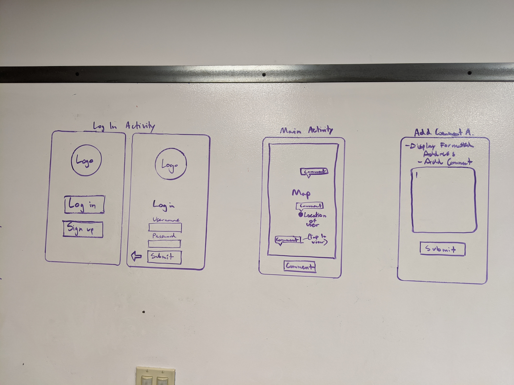
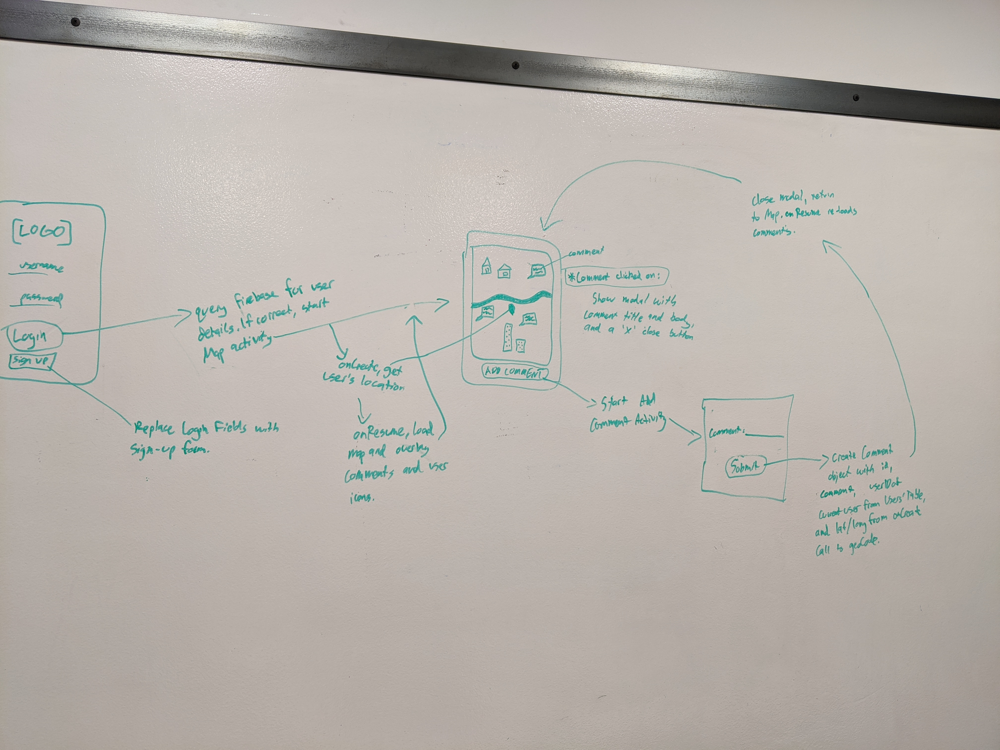
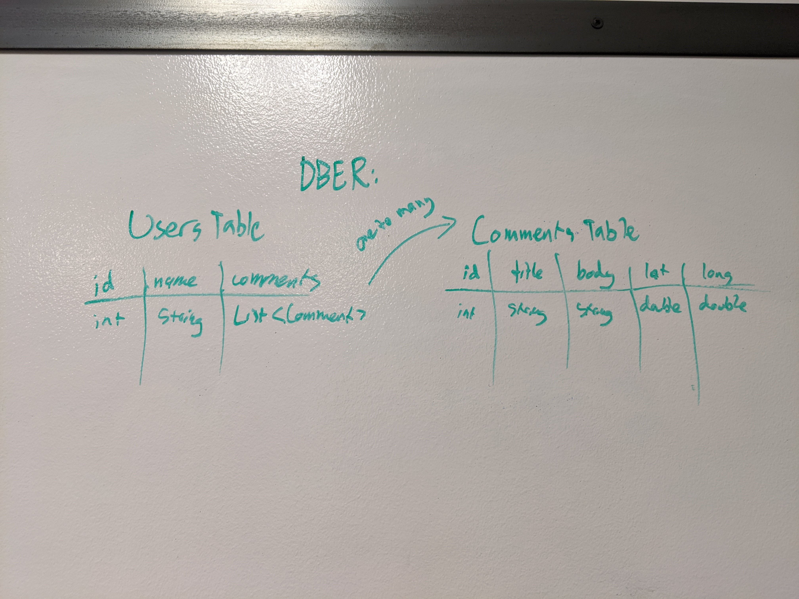

# Mapchat

An Android-based app where users can create, read, and reply to comments in real time using Google Maps.

## How to use:
  - On Android:
  
    - Install the  and run it on your device.
    
  - On an emulator:
  
    - Install Android Studio on your machine,
    - Clone this repo onto your machine via 'git clone https://github.com/BarberShop401/mapChat.git' in your terminal,
    - In Android Studio, click File > Import Project > find and select the build.gradle file in the root of the cloned repo folder,
    - Build the app,
    - Ensure you have an emulator set up in your AVD manager,
    - Click the green play button.

## Team Members
- Vik Akam
- Shingo Nakajima
- Lucas Wilber

## Project Management: Trello
https://trello.com/b/0Q5UCPBG/401-final-project-management

## User Stories
#### 1
As a user I want the ability to add comments so other people can see/reply to them.
##### Feature Tasks: 
1. Store the comments in Firebase 
2. Render comments on the map using data from Firebase

Acceptance test: Ensure the comments are being saved in Firebase and are rendered when queried

#### 2
As a user, I want to see my own comments appear on the map and others around me.
##### Feature Tasks: 
1. Display comments that you create as soon as they're created
2. Display all comments in an area around the user on the map
3. Add a timestamp to comments

Acceptance test: Ensure all comments around the user are visible
Acceptance test: Ensure new comments are visible after being created

#### 3.
As a user, I want to the map to show me only comments that are relevant to me.
##### Feature Tasks: 
1. Center the map on the user's location, zoomed in to show just their neighborhood
2. Display all comments in the user's general location

Acceptance test: Ensure that the map zooms in on the user when opened and displays comments around them

#### 4
As a user, I want a clean looking app so that I will feel like going back to it later.
##### Feature Tasks: 
1. Use colors (not default colors)
2. Use custom fonts
3. Create a logo 

Acceptance test: Ensure that people enjoy the look and it's easy to use and understand.

#### 5  
As a user I want to be able to reply to comments.
##### Feature Tasks: 
1. Add a Replies table to the db
2. Add a form for users to write and submit replies to comments
3. Attach replies to comments when they are rendered

Acceptance test: Ensure that replies can be created and displayed within comments

## Wireframes:

## Domain Model:

## DBER: 

